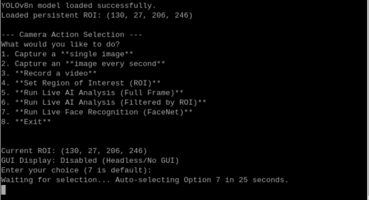

# AI-Camera

## Python-Based Intelligent Vision Framework for Raspberry Pi and Any Camera

AI-Camera is an open-source **Python** project designed to turn standard cameras into **AI-powered smart vision systems**.  
The project is **built around Raspberry Pi and the Pi Camera**, but thanks to its modular architecture, it can be **easily adapted to work with any camera source**, including USB webcams, IP cameras, and industrial cameras.

AI-Camera is ideal for **edge AI**, robotics, surveillance, and IoT applications.

---

## 🚀 Features

- Python-based and easy to extend
- Native support for **Raspberry Pi Camera**
- Easily adaptable to **USB, IP, and custom cameras**
- Real-time AI inference (YOLO-based)
- Modular and scalable architecture
- Region of Interest (ROI) detection
- Edge-optimized performance
- Database logging support

---

## 🧠 AI Capabilities

- Object detection
- Object filtering by class
- ROI-based detection logic
- Event-driven processing
- Detection result storage

---

## 📷 Camera Support

### Default
- Raspberry Pi Camera (CSI)

### Easily Adaptable To
- USB webcams
- IP / RTSP cameras
- Industrial cameras
- Video files (for testing)

> Only the camera capture layer needs modification.  
> AI inference and processing logic remain unchanged.

---

## 🏗 Architecture Overview

### High-Level Pipeline
- Camera Source
       ↓
- Capture Layer
       ↓
- Pre-Processing
↓
- AI Inference
↓
- Logic & Filtering
↓
- Output / Database

---

## ⚙️ Requirements

- All needed requirments are availabe in requirements.txt
- This document will explain the setup setp by step: docs/setup.txt
- This document will explain the auto service setup on the pi: docs/service-auto-creation.txt
---

## 🔧 Installation

```bash
git clone https://github.com/robomixes/ai-camera.git
cd ai-camera

▶️ Usage
python camera_app.py
OR
run_main.sh


Ensure:

Camera is connected and enabled

Required Python dependencies are installed

🔄 Using a Different Camera

To use a USB or IP camera, modify the camera initialization section in camera_app.py.

Example using OpenCV:

import cv2
cap = cv2.VideoCapture(0)

No changes are required in:

AI models

Detection logic

ROI configuration

Database handling

## Menu



## settings


